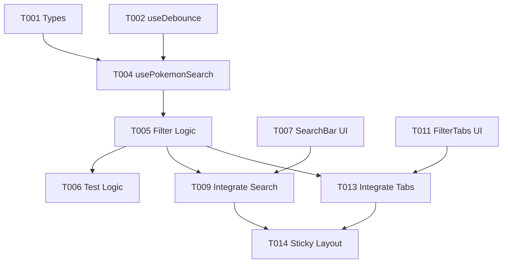

# Tasks: Search & Filter

**Feature Branch**: `005-search-and-filter`
**Status**: Pending

## Phase 1: Setup & Utilities
*Goal: Establish types and utility hooks required for filtering.*

- [x] T001 Create `FilterStatus` type in `src/types/index.ts`
- [x] T002 [P] Create `useDebounce` hook in `src/hooks/useDebounce.ts`
- [x] T003 [P] Create unit tests for `useDebounce` in `tests/unit/hooks/useDebounce.test.ts`

## Phase 2: Foundational Logic
*Goal: Implement the core filtering logic independent of UI.*

- [x] T004 [P] Create `usePokemonSearch` hook shell in `src/hooks/usePokemonSearch.ts`
- [x] T005 Implement filtering logic (Name/ID + Status) in `src/hooks/usePokemonSearch.ts`
- [x] T006 Create unit tests for `usePokemonSearch` logic in `tests/unit/hooks/usePokemonSearch.test.ts`

## Phase 3: User Story 1 - Search by Name or ID
*Goal: Allow users to search Pokemon by text input.*

- [x] T007 [US1] Create `SearchBar` component with clear button in `src/components/SearchBar.tsx`
- [x] T008 [P] [US1] Create unit tests for `SearchBar` in `tests/unit/components/SearchBar.test.tsx`
- [x] T009 [US1] Integrate `SearchBar` and `usePokemonSearch` into `src/App.tsx`
- [x] T010 [US1] Implement "No Pokemon found" empty state in `src/App.tsx` (or `PokemonList` wrapper)

## Phase 4: User Story 2 - Filter by Status
*Goal: Allow users to filter by collection status.*

- [x] T011 [US2] Create `FilterTabs` component in `src/components/FilterTabs.tsx`
- [x] T012 [P] [US2] Create unit tests for `FilterTabs` in `tests/unit/components/FilterTabs.test.tsx`
- [x] T013 [US2] Integrate `FilterTabs` into `src/App.tsx` and connect to `usePokemonSearch`

## Phase 5: User Story 3 - Sticky Header
*Goal: Ensure search and filter controls remain visible while scrolling.*

- [x] T014 [US3] Implement sticky positioning for Search/Filter container in `src/App.tsx`

## Phase 6: Polish & Cross-Cutting
*Goal: Final verification and edge case handling.*

- [x] T015 Verify special character handling in search (manual verification task)
- [x] T016 Verify mobile responsiveness of sticky header

## Dependencies

## Parallel Execution Opportunities

- **Setup**: T002 (Debounce) and T001 (Types) can be done in parallel.
- **UI Components**: T007 (SearchBar) and T011 (FilterTabs) are independent and can be built in parallel.
- **Logic vs UI**: T005 (Logic) can be implemented while T007/T011 (UI) are being built.

## Implementation Strategy

1.  **Utilities First**: Get the debounce hook and types ready.
2.  **Logic Core**: Build the `usePokemonSearch` hook and test it thoroughly with unit tests. This ensures the complex filtering logic (ID vs Name, 3-char limit, status intersection) is correct before touching the UI.
3.  **UI Components**: Build dumb components (`SearchBar`, `FilterTabs`) in isolation.
4.  **Integration**: Wire everything up in `App.tsx`.
5.  **Refinement**: Add sticky positioning and polish.
