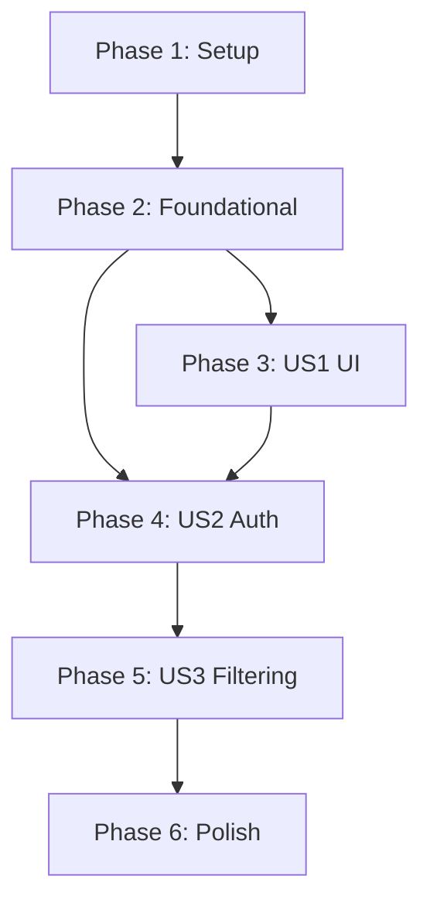

# Tasks: AI Chatbot Agent

**Feature**: `007-ai-chat-agent`
**Status**: Complete
**Total Tasks**: 24

## Phase 1: Setup
**Goal**: Initialize feature structure and environment.

- [x] T001 Create feature directory structure for components and services
- [x] T002 Define chat types and interfaces in `src/types/chat.ts`
- [x] T003 [P] Add Google Client ID to `.env.local` (instructions only)

## Phase 2: Foundational
**Goal**: Implement core services for Authentication and AI communication.
**Prerequisites**: Phase 1

- [x] T004 [P] Implement `googleAuth` service in `src/services/ai/googleAuth.ts` (GIS SDK wrapper)
- [x] T005 [P] Implement `useGoogleAuth` hook in `src/hooks/useGoogleAuth.ts`
- [x] T006 [P] Implement `gemini` service in `src/services/ai/gemini.ts` (API client)
- [x] T007 [P] Update `gemini-filter-function.json` to include `matching_pokemon_names` output field

## Phase 3: User Story 1 - Chat Interface Access
**Goal**: Users can open and close the chat window from the main application.
**Priority**: P1
**Prerequisites**: Phase 2

- [x] T008 [US1] Create `FloatingChatButton` component in `src/components/FloatingChatButton.tsx`
- [x] T009 [US1] Create `ChatWindow` layout component in `src/components/Chat/ChatWindow.tsx`
- [x] T010 [US1] Create `ChatMessage` component in `src/components/Chat/ChatMessage.tsx`
- [x] T011 [US1] Implement `useChat` hook for UI state in `src/hooks/useChat.ts`
- [x] T012 [US1] Integrate `FloatingChatButton` and `ChatWindow` into `src/App.tsx`

## Phase 4: User Story 2 - Provider Authentication
**Goal**: Users can authenticate with Google to use the chat.
**Priority**: P1
**Prerequisites**: Phase 3

- [x] T013 [US2] Create `AuthButton` component in `src/components/Chat/AuthButton.tsx`
- [x] T014 [US2] Integrate `useGoogleAuth` into `ChatWindow.tsx` to handle login state
- [x] T015 [US2] Implement login/logout flow in `ChatWindow.tsx`
- [x] T016 [US2] Display error states for authentication failures in `ChatWindow.tsx`

## Phase 5: User Story 3 - Conversational Filtering
**Goal**: Users can filter the Pokemon grid using natural language.
**Priority**: P2
**Prerequisites**: Phase 4

- [x] T017 [US3] Create `ChatInput` component in `src/components/Chat/ChatInput.tsx`
- [x] T018 [US3] Update `usePokemonSearch.ts` to support filtering by name list
- [x] T019 [US3] Implement `useGemini` hook in `src/hooks/useGemini.ts` to connect Chat to API
- [x] T020 [US3] Integrate `ChatInput` and `useGemini` into `ChatWindow.tsx`
- [x] T021 [US3] Implement message history handling in `useChat.ts`
- [x] T022 [US3] Connect AI filter response to `usePokemonSearch` filter state

## Phase 6: Polish & Cross-Cutting
**Goal**: Refine UX and handle edge cases.

- [x] T023 [P] Implement loading states and typing indicators in `ChatWindow.tsx`
- [x] T024 [P] Add error handling for API limits and network issues

## Dependencies

## Implementation Strategy

1.  **MVP (Phases 1-4)**: Focus on getting the UI up and the Google Auth working. This proves the "Client-side OAuth" risk is managed.
2.  **Core Value (Phase 5)**: Connect the Gemini API. Since we identified a data gap (missing types in client index), we will rely on the AI to return a list of matching Pokemon names (`matching_pokemon_names`) to perform the filtering.
3.  **Refinement (Phase 6)**: Polish the UI and add robust error handling.

## Parallel Execution Examples

- **Team A**: Work on **Phase 3 (UI)** components (`FloatingChatButton`, `ChatWindow`).
- **Team B**: Work on **Phase 2 (Services)** (`googleAuth`, `gemini` service).
- **Team C**: Work on **Phase 5 (Logic)** (`usePokemonSearch` updates) - *can start early*.
